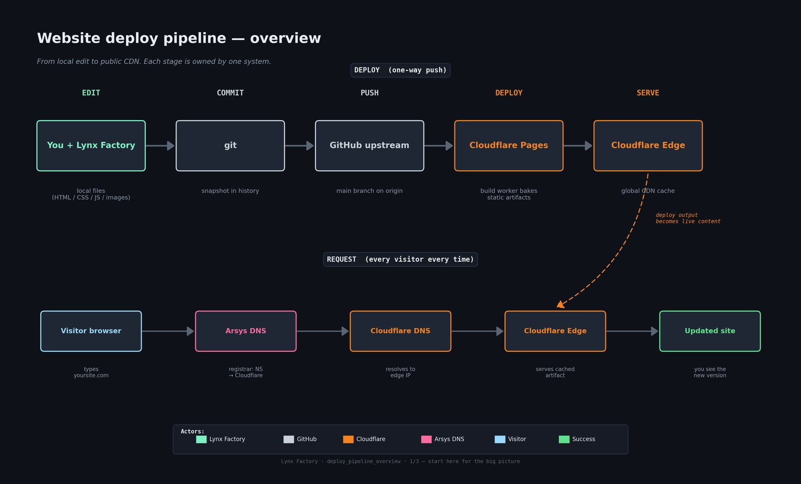

# Enriqueta Hueso — enriquetahueso.com

Bilingual (EN/ES) artist-portfolio website for **Enriqueta Hueso**.

- **Live site:** https://www.enriquetahueso.com
- **Hosting:** Cloudflare Pages (deployed via `wrangler`)
- **DNS:** Arsys (registrar) → Cloudflare nameservers
- **Repo:** https://github.com/borjatarraso/enriquetahueso
- **Stack:** Python static-site builders (`build_site.py`, `build_gallery.py`) + handcrafted CSS themes (dark / light)

> This is the oldest project in the workshop (folder created
> 2026-04-18). It was decoupled from the sibling `galeriaomaso` site on
> 2026-05-17 — cross-links between the two now use absolute URLs.

> 🤝 **Are you an external contributor?**
> Everything between here and the Contributing section describes how the
> **maintainer** (Borja Tarraso) operates the site day-to-day — direct
> pushes to `main`, local helper tooling (Lynx Factory, multiplexers,
> auto-redeploy watchers), Cloudflare credentials, etc. **You do not need
> any of that.** Jump straight to [Contributing](#contributing) for the
> fork → branch → Pull Request workflow that's open to anyone.

---

## How a content change reaches visitors

```
edit  →  build  →  commit  →  push  →  Cloudflare build  →  serve from edge
```

Compared to a pure-static site, this repo has one extra stage: the
Python builders regenerate the `public/` tree from the source content
(`gallery-data.json`, templates, raw images) before the commit.

### Overview diagram



> Click for full resolution: [`docs/deploy_pipeline_overview.png`](docs/deploy_pipeline_overview.png)

### Detailed diagram (stages + APIs + cache layers + DNS)


> Full-screen: [`docs/deploy_pipeline_detailed.png`](docs/deploy_pipeline_detailed.png)

### Internals (every API call, fallback, verify loop)


> Full-screen: [`docs/deploy_pipeline_internals.png`](docs/deploy_pipeline_internals.png)

---

## Day-to-day maintainer workflow

> Only the maintainer (Borja Tarraso) has push access to `main`. If you're
> an external contributor, the workflow you want is in
> [Contributing](#contributing) — fork, branch, Pull Request.

```bash
# 1. edit content / gallery data / template
$EDITOR gallery-data.json

# 2. regenerate the public/ tree
python3 build_site.py
python3 build_gallery.py

# 3. preview locally
xdg-open public/index.html

# 4. commit + push the regenerated public/ alongside the source
git add -A
git commit -m "Add new exhibition entry"
git push origin main

# 5. wait ~30–60 s, then verify the live site has the new version
curl -sI https://www.enriquetahueso.com/css/styles.css | grep -i etag
```

If the live site does **not** pick up the change within ~2 minutes, see
the troubleshooting section — Cloudflare's GitHub auto-deploy can
silently disconnect, which is exactly why we built the verification
tooling described next.

---

## Why we ship our own verifier

Cloudflare's "push and forget" GitHub integration looks reliable but has
two failure modes that are silent from the publisher's point of view:

1. **The webhook can desync.** A repo permission change, a token rotation
   or even a transient GitHub outage can leave the integration in a
   "connected but not firing" state. The dashboard still says *Connected*.
2. **A build succeeds without reaching the edge.** The build log is
   green, but the asset that the public sees still hashes to the
   previous version — usually a cache-busting or route-conflict edge
   case.

Our companion tool (**Lynx Factory** — a local-only dashboard) closes
both gaps by:

- Hashing the local artifact (`css/styles.css`) with SHA-256.
- Fetching the same asset from the live URL.
- Comparing the two. If they differ, it re-issues the deploy with
  `wrangler` and polls every 5 s for up to 90 s.

The **Test** button in that dashboard turns **green only when the live
SHA matches local**. No more "I pushed, looks fine, but visitors see the
old page".

> **Heads-up:** never use an HTML page as the fingerprint asset.
> Cloudflare's bot-management layer injects a per-request `<script>` tag
> into HTML responses, so the hash always changes. Pick a CSS/JS/font/
> image asset instead — for this repo we use `css/styles.css`.

---

## Cloudflare configuration (sanitized)

The deploy verifier and the auto-redeploy watcher need three pieces of
metadata. Real values live only in shell env vars (`CF_API_TOKEN_*`) on
the maintainer's machine — **never** committed.

| Setting | Value |
|---------|-------|
| Account ID | `XXXXXXXXXXXXXXXXXXXXXXXXXXXXXXXX` |
| Zone ID (enriquetahueso.com) | `XXXXXXXXXXXXXXXXXXXXXXXXXXXXXXXX` |
| Pages project | `enriquetahueso` |
| Deploy method | `wrangler` (runs `npx wrangler deploy` from `public/`) |
| API token env var | `CF_API_TOKEN_ENRIQUETAHUESO` |
| Fingerprint asset | `css/styles.css` |
| Auto-redeploy branch | `main` |

### Token scope (least-privilege)

The deploy token only needs:

- **Account → Cloudflare Pages → Edit**
- **Zone → enriquetahueso.com → Cache Purge → Purge** *(optional, for
  manual cache busts)*

We deliberately do **not** use the broader "account-wide admin" token
here — least-privilege keeps the blast radius small if the token ever
leaks.

```sh
# ~/.bashrc.d/enriquetahueso_cf.sh   (chmod 600, never committed)
export CF_API_TOKEN_ENRIQUETAHUESO="cfat_XXXXXXXXXXXXXXXXXXXXXXXXXXXX"
export CF_ZONE_ID_ENRIQUETAHUESO="XXXXXXXXXXXXXXXXXXXXXXXXXXXXXXXX"
```

After editing:

```bash
source ~/.bashrc.d/enriquetahueso_cf.sh
# restart the local dashboard so the env var is picked up
```

---

## Troubleshooting

### "I pushed but the site looks unchanged"

```bash
# 1. did the push reach GitHub?
git log origin/main -1

# 2. did Cloudflare build it?
#    → check the Pages deployments tab in the dashboard

# 3. does the live asset differ from the local one?
sha256sum public/css/styles.css
curl -s https://www.enriquetahueso.com/css/styles.css | sha256sum

# 4. force a redeploy from the local checkout
cd public && npx wrangler deploy
```

### Cloudflare GitHub integration looks "connected" but doesn't fire

Disconnect and reconnect in **Workers & Pages → enriquetahueso →
Settings → Builds & deployments → Source**. Then push a trivial commit
to verify the webhook actually triggers a new build.

### DNS / TLS

- Nameservers must point at Cloudflare (managed at Arsys).
- TLS mode in Cloudflare: **Full (strict)**.
- Always Use HTTPS: **On**.

---

## SEO & visibility

This section documents the on-page and infrastructure techniques applied
to improve discoverability, social-share appearance, and Core Web Vitals.

### What's implemented

**Crawler infrastructure**
- `public/robots.txt` — allows all crawlers, points to the sitemap.
- `public/sitemap.xml` — generated by `gen_sitemap.py`; lists all 325
  canonical URLs (top-level + 313 posts) with `<lastmod>`,
  `<changefreq>`, `<priority>`. Canonical URLs are `.html`-less because
  Cloudflare Pages 307-redirects `.html` → no-extension; matching
  canonicals prevent duplicate-content dilution.

**Per-page meta**
- `<link rel="canonical">` on every page — consolidates link equity to
  the canonical URL, prevents Google indexing both `/site/artistas` and
  `/site/artistas.html` as separate documents.
- Per-page `<title>` and `<meta name="description">` on every top-level
  page (artistas, exposiciones, internacional, ...). Each describes the
  page contents specifically rather than reusing a generic site
  description.
- `<meta name="robots" content="index, follow, max-image-preview:large">`
  — lets Google show large image thumbnails in SERP, useful for an
  art-gallery site.
- `<meta name="theme-color">` — branded browser-chrome on mobile.

**Social cards (Open Graph + Twitter Card)**
- `og:title`, `og:description`, `og:url`, `og:image`,
  `og:image:width/height`, `og:locale`, `og:locale:alternate` × 8
  languages, `og:site_name`, `og:type` (`article` for posts,
  `website` for the rest).
- `twitter:card = summary_large_image` with matching title /
  description / image.
- Shared 1200×630 branded card at `/img/brand/og-image.jpg`, generated
  by `gen_brand_assets.py`. WhatsApp, Facebook, LinkedIn, Slack,
  Discord, Telegram and X/Twitter all render this when a page is
  shared, instead of the blank preview they showed before.

**Favicons & PWA**
- Full set in `/img/brand/`: SVG (scalable), 16 / 32 / 192 / 512 PNG,
  180×180 apple-touch-icon, multi-resolution `favicon.ico`.
- `site.webmanifest` — Android home-screen install (PWA-lite).
- All generated programmatically by `gen_brand_assets.py` (EH monogram
  in gold serif on warm-dark background, matching the nocturne theme).

**Structured data (schema.org JSON-LD)**
- `Person` + `VisualArtist` schema on `index.html` — feeds Google's
  knowledge-panel result for name searches (photo, birth place, alumni
  of UPV, jobTitle, works at Galería O+O, expertise list).
- `WebSite` schema linked to the Person via `publisher`.

**Image optimization (accessibility + ranking)**
- `loading="lazy"` + `decoding="async"` on every `` (2,602 tags
  across legacy posts/pages) — defers off-screen images, improving
  Core Web Vitals (LCP, INP) which Google uses as a ranking signal.
- Meaningful `alt` text on every image that previously lacked it —
  1,764 images now indexable by Google Images (a non-trivial referral
  source for visual artists). Intentionally-empty `alt=""` is left
  untouched (it's a valid pattern for decorative images).

**Caching (already in place via `public/_headers`)**
- Long-lived `immutable` cache for fingerprinted assets (CSS, JS,
  images, fonts) and zero-cache HTML — fresh content always served, but
  repeat visitors only download the HTML shell.

### Cloudflare dashboard toggles (enable separately)

These improve performance and analytics but are configured in the
Cloudflare dashboard, not in the repo:

- **Web Analytics** (Pages → Settings → Functions → Web Analytics) —
  privacy-friendly, cookieless, no banner needed. Auto-injects the
  beacon on every page served by Pages.
- **Speed → Optimization → Polish (Lossless) + WebP** — auto-converts
  gallery JPEG/PNG to WebP for browsers that support it.
- **Speed → Optimization → Brotli** — usually on by default; verify.
- **Caching → Tiered Cache** — faster global edge propagation.
- **Caching → Always Online** — serves the last-cached version during
  origin outages.
- **Bulk Redirects** — if any old Blogger URLs still receive traffic,
  add 301 redirects to consolidate link equity onto the new URLs.

### Regenerating SEO artifacts

```bash
# Whenever new pages or posts are added:
python3 gen_sitemap.py        # rebuilds public/sitemap.xml + robots.txt

# If the brand image or favicons need updating:
python3 gen_brand_assets.py   # rewrites public/img/brand/*

# To inject SEO meta into newly-added legacy pages (idempotent — skips
# files already marked with the SEO-META-INJECTED comment):
python3 seo_inject.py

# To add alt + lazy-loading to newly-added images:
python3 img_alt_fix.py
```

After regenerating, follow the normal commit + push flow.

### What this *doesn't* do

On-page SEO removes blockers and amplifies whatever inbound interest
exists; it doesn't manufacture demand. The next big visibility lever is
external — gallery directories, press features, links from museum and
academic sites, and registering the site with:

- **Google Search Console** (`search.google.com/search-console`) —
  submit the sitemap, see real query data and indexing errors.
- **Bing Webmaster Tools** — same for Bing / DuckDuckGo.
- **Artist directories**: Artsy, ArtFacts, local Valencian cultural
  registries, university alumni listings, gallery aggregators.

---

## Full deployment guide

A complete, plain-language walkthrough of the whole pipeline — including
zero-knowledge onboarding, an internals appendix, and a glossary — is
shipped alongside this README in both English and Spanish.

- 📕 English: [`docs/deploy_pipeline_guide_en.pdf`](docs/deploy_pipeline_guide_en.pdf)
- 📗 Español: [`docs/deploy_pipeline_guide_es.pdf`](docs/deploy_pipeline_guide_es.pdf)

Both PDFs embed the three diagrams above at full resolution.

---

## Layout

```
.
├── build_site.py           # main static-site builder
├── build_gallery.py        # gallery / exhibition page builder
├── generate_docs.py        # builds the EN/ES instruction PDFs in docs/
├── sanitize_site.py        # post-build sanitizer (strips dev artifacts)
├── gen_sitemap.py          # generates public/sitemap.xml + robots.txt
├── gen_brand_assets.py     # generates og-image + favicon set
├── seo_inject.py           # injects canonical/OG/Twitter meta into pages
├── img_alt_fix.py          # adds alt + loading="lazy" to legacy images
├── gallery-data.json       # source of truth for exhibition data
├── index.html              # source landing page
├── css/                    # source stylesheets
├── js/                     # source scripts
├── img/                    # source images
├── public/                 # generated output — `wrangler deploy` runs here
├── site/                   # legacy staging tree (kept for reference)
└── docs/                   # human-facing documentation (this guide)
```

---

## Contributing

This repo is public on GitHub and external contributions are welcome. You do
**not** need Lynx Factory, the multiplexer, or any of the local tooling
described above — those are operator conveniences for the maintainer. A plain
git + Python + GitHub workflow is enough.

```bash
# 1. fork the repo on GitHub (Fork button, top-right of the repo page)
# 2. clone your fork
git clone https://github.com/<your-username>/enriquetahueso.git
cd enriquetahueso

# 3. create a topic branch
git checkout -b add/new-exhibition-entry

# 4. edit source content (gallery-data.json, templates, css, images...)
$EDITOR gallery-data.json

# 5. rebuild the public/ tree so reviewers can see the rendered output
python3 build_site.py
python3 build_gallery.py

# 5b. if you added new pages or posts, regenerate SEO artifacts
#     (see "SEO & visibility" section for what each script does)
python3 gen_sitemap.py        # rebuilds public/sitemap.xml + robots.txt
python3 seo_inject.py         # adds canonical + OG + Twitter meta
python3 img_alt_fix.py        # adds alt + lazy-loading to new images

# 6. preview locally
xdg-open public/index.html

# 7. commit + push to your fork (include both source AND regenerated public/)
git add -A
git commit -m "Add 2026 Helsinki exhibition entry"
git push -u origin add/new-exhibition-entry

# 8. open a Pull Request on GitHub
#    Your fork's page will show a "Compare & pull request" button.
#    Target the upstream `borjatarraso/enriquetahueso` repo, `main` branch.
```

> GitHub calls these **Pull Requests** (PRs); GitLab calls the same thing
> Merge Requests (MRs). Same concept either way.

**Borja Tarraso** (`<borja.tarraso@member.fsf.org>`) will review every PR and
either merge it (sometimes with small adjustments) or leave review comments
explaining why a change can't be accepted in its current form. Please:

- Keep PRs focused — one logical change per PR is easier to review than a
  large multi-purpose patch.
- Always commit the **regenerated `public/` tree** alongside your source
  edits — the deploy reads from `public/`, so a PR that only changes source
  would deploy nothing.
- Write a short PR description explaining *why* the change is useful, not
  just *what* the change is.
- For bigger ideas (new sections, design changes, structural moves), open a
  GitHub issue first to agree on the approach before investing time.

---

## License & author

Author: **Borja Tarraso** &nbsp;`<borja.tarraso@member.fsf.org>`

This repository is released under the **BSD-3-Clause** license.
